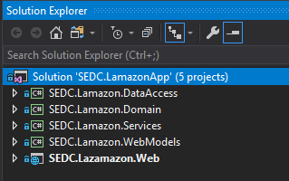

# Lamazon Application
## From brainstorming to e2e solution 🚀
### 

## Brainstorming 🧠
**Brainstorming** is the first part when we talak about some software implementation. This is the part where we put our ideas on a piece of paper, and then in the process of planning and implementation we somehow, magically turn them into a real software solution (final product). 
That is exactly what we did in the first lecture of the Practical ASP.NET course. 

## Planning 🗓️
Furhter we discussed about all the business entities that we need so that we can develop an application that will serve as an online store where the users that will use our app can register their account, log in, search for products, put them in their cart and finally buy them. 

So we can say that this is the part where we plan what entities we will need, how they will be connected with each other and what properties will they need. 

## Architecture 📐
After we got some initial perception for our entities that are mabybe one of the most important parts of our app, then we discussed about the architecture that our software will have, so that it will be more secure and we will keep things separated so our code can be easy maintainable and there will be a separation of concerns.

As we agreed, we start build our software solution by using **N-Tier architecture**. 

So for that purpose we created a new project in Visual Studio, and inside the solution we created five separate projects (class libraries).

## Hands on coding! ⚙️

### SEDC.Lamazon.Domain
After we created the 5 projects like on the picture above, we started to implement first our models. 
So we created our Domain models that further in the process of development we want to translate them in our database tables as well as the enums that we need.

### SEDC.Lamazon.DataAccess
After we finished with our models we moved to implementation on our DataAccess project, where the magic happens. In the DataAccess layer we separate the structure into multiple folders like, Interfaces and Repositories. In the interface folder we add the IRepository interface and the IUserRepository. In the Repositories folder we add all the repositories that we need for our models or OrderRepository, UserRepository and so on. 

**It is important to notice that our Repositories implements the interfaces. Basically they are their implementation in which we take care for all the CRUD operations for our models.**

** **Here we also add a BaseRepository in which we only inject an instance of our DbContext class, that's why all our repositories inherit from BaseRepository class, so that in every repository we will have reference to our DbContext class, which is a reference to our database.** **

Further in the DataAccess layer we implement the LamazonDbContext class that we need so that by using EntityFramework we can translate our domain models into a database tables. This LamazonDbContextClass inherites from IdentityDbContext<<User>User> class which takes care for our user authentication and authorization implementation (It will be explained more in details in the Readme.md file for IdentityManager Configuration).

Here we also override the OnModelCreating() method and specify all the relations between our entities. In other words we tell the EntityFramework how we want to configure the database for us. Also we seed some data in the same method.

(Read about the services implementation before this paragpraph)  
After all of this, we open the NugetPackageManager Console, select the SEDC.Lamazon.DataAccess project as a Default one, and type the two already known commands. 
* Add-Migration Initial(or whatever name would you prefer)
* Update-Database

### SEDC.Lamazon.Services
This projcet is where all the business logic is located. Here we also separate the structure but in three folders. Helpers, Interfaces and Services folder. In the services folder we implement all the services for every entity with all the methods 

* #### Helpers
In this folder we create our helper classes. They are AppSettings.cs and DIModule.cs
1. AppSettings.cs - In this class we only declare one property that we will use just as a helper to get the connection string to our database from the appSettings.json file

2. DIModule.cs - In this class we add one static method that will return IServiceCollection with two input parametars as it is showed further and it is called RegisterModule(IServiceCollection services, string connectionString). 

As the N-tier architecture specifies, we don't want reference from DataAccess layer to our Presentation layer or the Application layer. Since we have to register our Repositories and Services in Startup.cs which is located in the Application layer we must reference DataAccess project with the Application project (Which we don't want by any chance!!!).

So the purpose of this helper class is that we make a "ring road" so instead of referencing the DataAccess and Application, we reference the DataAccess with the Services layer which is ok! In the RegisterModule method we do nothing special, only registering the DbContext and our Repositories and Services, just as we did on MVC, but directly in the Startup.cs Then we call this method in the Startup.cs class, and again the same thing is achieved, just according to the N-tier architecture rules. 

After we register this in our Startup.cs class, then we start with the migrations and database thing.(Go back to the last paragraph of the previous section).

* #### Interfaces
In this folder we have the interfaces as an abstraction to our services.

* #### Services 
In this folder we have the actual Service classes with implementation of all the CRUD methods that communicate with the appropriate repositories so that we can store in or read from the database.

